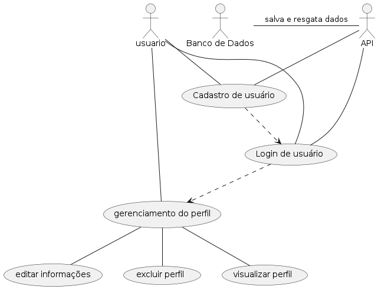

# Animes Avaliable

O frontend foi desenvolvido por meio de um projeto react com Typescript usando o **vite** para melhor gerenciar os módulos. Umaapresentação mais resumida pode ser encontrada na raiz deste repositório remoto.

## Features omplementadas

As features implementadas foram:

1. Cadastro de usuário: para acessara aplicação, o usuário deve ter uma conta cadastrada. Os dados deverão ser salvos em um Banco de dados.
2. Login de usuário: para efetuar esta ação, o usuário deverá ter uma conta cadastrada com sucesso.

> Em todos os campos de entrada das features implementadas, somente a validação simples do campo está sendo feita, uma vez que o frontend não está conectado nem a uma API e nem a um Banco de dados.

O comportamento delas pode ser visto pelo seguinte diagrama de caso de uso:

<div style="display: flex; justify-content: center;">
  
</div>

## Ferramentas utilizadas

* NodeJS: criação do projeto;
* PNPM: gerenciamento de pacotes, uma versão melhorada do NPM;
* Vite: gerenciamento dos módulos;
* MaterialUI: criação responsiva da interface de usuário;
* Zod + HookForm: validação dos formulários;
* Axios: gerenciar as requisições.

## Configuração do projeto

É necessário que tenha o NodeJS intalado. Para confirmar, abra o terminal e use o comando `node -v` ou `npm -v` (que vem instalado junto com o nodejs).

Confirmando tal requisito, é recomendável verificar se o gerenciador de pacotes **pnpm** está instalado. Para isto, use o comando `pnpm -v`. Caso não esteja, instale-o utilizando o comando `npm install -g pnpm`.

Com tudo isto confirmado, utilize o seguinte comando para instalar todas as dependências do projeto e, posteriormente, executar a aplicação em modo desenvolvedor:
```JavaScript
//instalar as dependências
pnpm i

//executar a aplicação
pnpm run dev
```