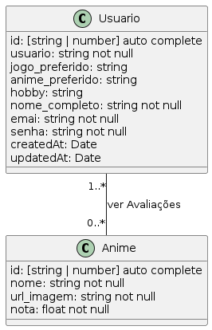

# Animes Available

Projeto criado para consolidar os conceitos vistos durante as aulas assincronas vistas na plataforma da Proz - Talentos Cloud.

O objetivo inicial da aplicação é colher avaliações de vários usuários cadastrados de alguns títulos já existentes no sistema.

## Estrutura

A Animes Available apresenta apenas duas classes implementadas: Usuário e Anime. O classe "Usuário" representa as informações necessárias e opcionais do usuário e o mesmo vale para a classe "Anime".

  

Tendo isto em mente, a versão atual implementa as funcionalidades de Login e Cadastro de usuário (não recebe e nem envia requisições a uma API)

  

# Créditos

Durante o desenvolvimento da aplicação, algumas ferramentas ou referências foram usadas, não só para desenvolvimento da aplicação mas também para a documentação da própria.

- A construção dos diagramas foram feitos usando o editor online [plantuml.mseiche.de](https://plantuml.mseiche.de/).
- Os códigos SQL foram implementados e executados no compilador online [sqliteonline.com](https://sqliteonline.com/)