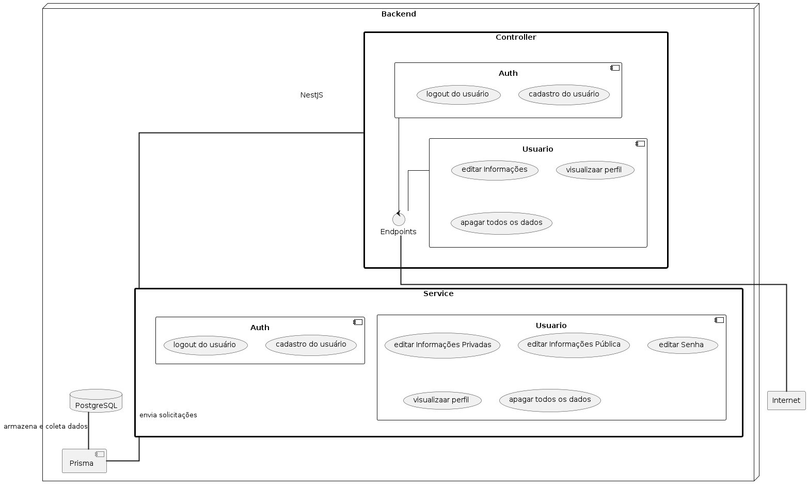
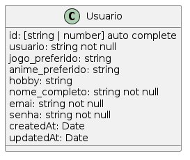

# Backend - Animes Available

O backend do sistema Animes Available foi desenvolvido utilizando o framework **nestjs** e o ORM (Object-Relational Mapping) **prisma** para facilitar a interação com o Banco de Dados **PostgreSQL**.

A documentação da API se encontra no [Postman](https://elements.getpostman.com/redirect?entityId=27413236-1a73bc01-7075-4faa-8e4f-96b2b19c1aa0&entityType=collection) contendo os endpoints implementados até a versão atual vista neste repositório. Entretanto, como a aplicação ainda está em desenvolvimento, vale citar as funcionalidades que já foram desenvolvidas e testadas sendo elas estáticas.

1. **Cadastrar**: Cadastrar um usuário na aplicação
2. **Login**: Efetuar o login na aplicação, obtendo um token de acesso.
3. **Gerenciamento do Perfil**: Fazer edições nas informações, alémde visualizar e excluir o perfil do usuário.

<div align="center">
  
</div>
<p align="center">Diagrama de componentes.</p>

O diagrama ilustra bem como está organizado os principais componentes da aplicação. O controller é o componente responsável por tratar (em alto nível usando DTO e class validation) as requisições vinda da internet. Ele, também, é responsável por se comunicar diretamente com o Service. O componente Service é responsável por fazer as validações mais baixo nível e se comunica diretamente com o Prisma - agente responsável por se comunicar com o Banco de Dados, para enviar solicitações de armazenamento e/ou coleta de dados no Banco de Dados em questão (PostgreSQL).

As funcionalidade são disponibilizas para a internet por meio de endpoints.
> Vale Ressaltar que esta aplicação não trata todas as vulnerabilidades listadas no OWASP TOP 10.

## Entidades

Atualmente, na versão 0.4.0, a aplicação só possuí uma entidade. O usuário, uma das duas entidades principais, possuí os dados cadastrais e dados de perfil de usuário, diminuindo a complexidade das buscas de informações no Banco de Dados.

<div align="center">
  
</div>
<p align="center">Classe Usuário</p>

## Autenticação

É necessário que o usuário faça o login na aplicação, recebendo um token de acesso para poder acessar as funcionalidades do sistema. Para isto, ele deverá informar o usuário e senha correto para que seja gerado um token JWT que será usado em todas as futuras requisições, passando o token de acesso pelo cabeçalho da requisição (Bearer token).

## Integridade

Todos os campos de formulários necessários para as features estão sendo tratadas. É importante visitar a documentação completa da API para ver quais os campos obrigatórios e não obrigatórios ao enviar uma requisição.

## Ferramentas utilizadas

* NestJS: criação do projeto;
* Prisma: interação com o Banco de Dados;
* PNPM: gerenciamento de pacotes, uma versão melhorada do NPM;
* JWT Token: autenticação do usuário.

## Configuração do projeto

É necessário que tenha o NodeJS intalado. Para confirmar, abra o terminal e use o comando `node -v` ou `npm -v` (que vem instalado junto com o nodejs).

Confirmando tal requisito, é recomendável verificar se o gerenciador de pacotes **pnpm** está instalado. Para isto, use o comando `pnpm -v`. Caso não esteja, instale-o utilizando o comando `npm install -g pnpm`.

Com tudo isto confirmado, utilize o seguinte comando para instalar todas as dependências do projeto e, posteriormente, fazer as migrações no banco de dados, gerar o client prisma e executar a aplicação em modo desenvolvedor:
```JavaScript
//instalar as dependências
pnpm i

//criar e aplicar as migrações no banco de dados
pnpm dlx prisma migrate

//gerar o prisma cliente usado na interação entre a aplicação e o Banco de Dados
pnpm dlx prisma generate

//executar a aplicação no modo desenvolvedor
pnpm run start:dev
```

## Referências utilizadas

* [NestJS](https://docs.nestjs.com/): Documentação do framework.
* [Postman](https://www.postman.com/): Ferramenta para testar o backend.